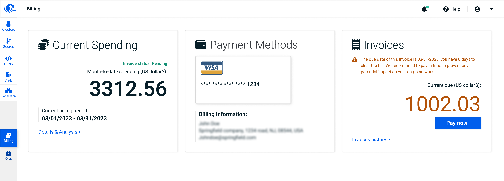

This guide provides detailed information on the billing procedures, and how to manage your bills and payment methods. Understanding these elements will help you effectively manage your costs while using RisingWave Cloud services.

## Billing process

RisingWave Cloud employs a detailed billing cycle that ensures accuracy and transparency in charging for the use of its services. Here's how it works:

- **Billing frequency**: RisingWave Cloud calculates charges for each project at 15-minute intervals. This aligns with the quarters of an hour and ensures precision of up to 30 seconds.

- **Billing time zone**: All billing calculations are performed in Coordinated Universal Time (UTC), ensuring consistency regardless of your geographical location.

- **Monthly invoicing**: At the start of each month, RisingWave Cloud issues an invoice that consolidates the usage and associated costs for all your projects from the preceding month.

## Understanding your service fee

RisingWave Cloud offers two types of project plans to cater to your specific needs:

- **Free** (Trial plan)

    The Trial plan is offered for free. This plan equips you with all the essential resources needed to test and experience the features offered by RisingWave.

- **Pay-as-you-go** (Standard plan)

    You only pay for your actual usage of computational resources and storage. To help you keep track of your expenditures, RisingWave Cloud employs the RisingWave Unit (RWU), a virtual unit of resources, and the hours of usage to calculate your charges.

See details in [Pricing](/billing-pricing.md).

## Monitoring current usage and spending

You can view the usage and the corresponding charges for each project during the ongoing billing period.

See details in [Check current spending](/billing-check-spending-details.md#check-current-spending).

## Reviewing and paying invoices

Each month, RisingWave Cloud generates an invoice summarizing your service usage and associated charges for the previous billing period. Normally, you can expect to receive your invoice within the first few days of the new month. This invoice provides a breakdown of your usage.

If there are any outstanding payments, you can settle them manually. You can also access your history invoices.

See details in [Review and pay invoices](/billing-review-and-pay-invoices.md).

## Setting up automatic payments

You can automate payments through saved bank cards. After each billing period, RisingWave Cloud will automatically charge your saved cards.

See details in [Manage payment methods](/billing-manage-payment-methods.md).

## Settling outstanding payments

You can settle outstanding payments manually during the due period if automatic payments fail.

See details in [Pay invoices manually](/billing-review-and-pay-invoices.md#pay-invoices-manually).