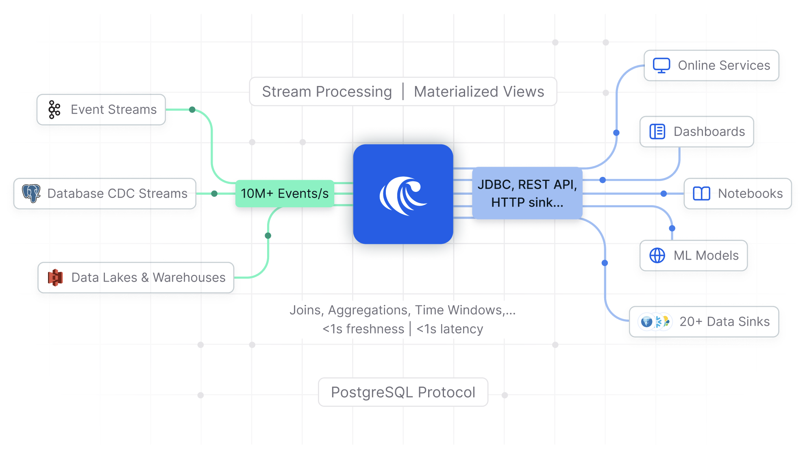

<head>
  <link rel="canonical" href="https://docs.risingwave.com/docs/current/intro/" />
</head>

<!-- MDX imports -->
import DefaultButton from "@site/src/components/DefaultButton";
import LightButton from "@site/src/components/LightButton";

RisingWave is a Postgres-compatible SQL database engineered to offer the ***simplest*** and ***most cost-effective*** approach for **processing**, **analyzing**, and **managing** real-time event streaming data.

RisingWave can ingest millions of events per second, continuously join and analyze live data streams with historical tables, serve ad-hoc queries in real-time, and deliver fresh, consistent results wherever needed.

  <DefaultButton text="Get Started" doc="get-started" />

## When is RisingWave the perfect fit?

RisingWave is the ideal solution for:

- Managing real-time data sources like Kafka streams, database CDC, and more.
- Executing complex, on-the-fly queries, including joins, aggregations, and time windowing.
- Interactively and concurrently exploring consistent, up-to-the-moment results.
- Seamlessly delivering results to downstream systems.
- Processing both streaming and batch data with a unified codebase.

## In what use cases does RisingWave excel?

RisingWave is particularly effective for the following use cases:

- **Streaming analytics**: Achieve sub-second data freshness in live dashboards, ideal for high-stakes scenarios like stock trading, sports betting, and IoT monitoring.
- **Event-driven applications**: Develop sophisticated monitoring and alerting systems for critical applications such as fraud and anomaly detection.
- **Real-time data enrichment**: Continuously ingest data from diverse sources, conduct real-time data enrichment, and efficiently deliver the results to downstream systems.
- **Feature engineering**: Transform batch and streaming data into features in your machine learning models using a unified codebase, ensuring seamless integration and consistency.

## Comparing RisingWave with other systems

RisingWave is not simply an "alternative" to any existing product, but it is often compared with stream processors, analytical databases, and operational databases.

### Stream processors

Stream processors like ksqlDB, Spark Structured Streaming, and Flink SQL are frequently compared to RisingWave. While these systems have their strengths, RisingWave offers an exceptionally simple, PostgreSQL-style user experience, and eliminates the need for manual state management. It excels in:

- Handling complex queries like joins, aggregations, and time windows with high performance.
- Transparent dynamic scaling, allowing for scaling in and out within seconds rather than minutes or hours.
- Instant failure recovery, where RisingWave recovers in seconds rather than minutes or hours.

Additionally, RisingWave greatly simplifies overall architecture, see [How does RisingWave simplify your event-driven architecture?](#how-does-risingwave-simplify-your-event-driven-architecture). However, compared to these stream processors, RisingWave does not offer low-level Java and Scala APIs, but compensates by offering various language UDFs and SDKs.

### Analytical databases

Modern analytical databases, such as ClickHouse with materialized views, Snowflake with dynamic tables, BigQuery with continuous queries, and Databricks with Delta Live Tables, offer continuous processing capabilities. RisingWave surpasses these solutions in continuous processing by:

- Offering a rich feature set for stream processing, including time windowing, watermarks, and more.
- Being particularly optimized for handling complex streaming joins.
- Allowing data ingestion from and delivery to any system, without locking you into a specific ecosystem.

Moreover, RisingWave’s transparent dynamic scaling and instant failure recovery mechanisms are superior to other analytical databases.

However, RisingWave does not feature columnar storage. If your workloads mostly involve ad-hoc, long-range scans rather than predefined queries, an analytical database might be a better fit.

### Operational databases

RisingWave is PostgreSQL wire-compatible, enabling seamless integration with most tools in the PostgreSQL ecosystem. RisingWave is designed specifically for storing and processing streaming data, making it particularly well-suited for managing metrics and events rather than transactional data.

Note that RisingWave does not use the PostgreSQL engine internally, which results in certain PostgreSQL tools not being supported. Additionally, RisingWave does not support read-write transactions.

## How does RisingWave simplify your event-driven architecture?

RisingWave aims to help simplify event-driven architecture. You can think of RisingWave as a unified system that combines event streaming, stream processing, storage, and serving capabilities. Developers can express intricate stream-processing logic through cascaded materialized views. Additionally, it allows users to persist data directly within the system, eliminating the need to deliver results to external databases for storage and query serving.

<LightButton text="See the architecture" doc="architecture"/>
<LightButton text="Access the source code" url="https://github.com/risingwavelabs/risingwave"/>
 
