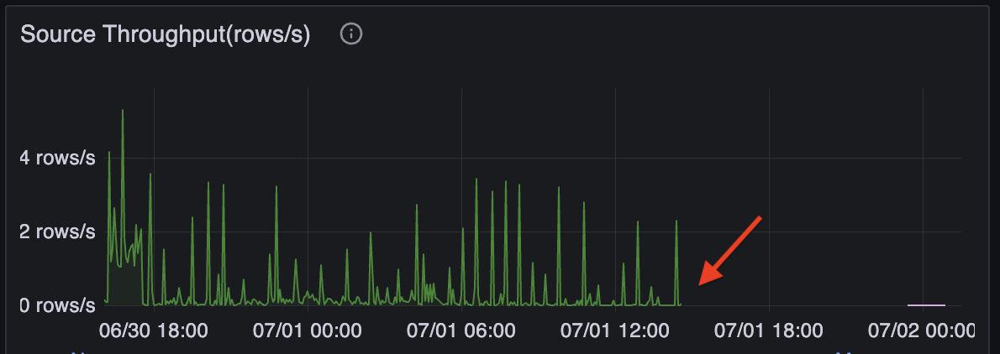
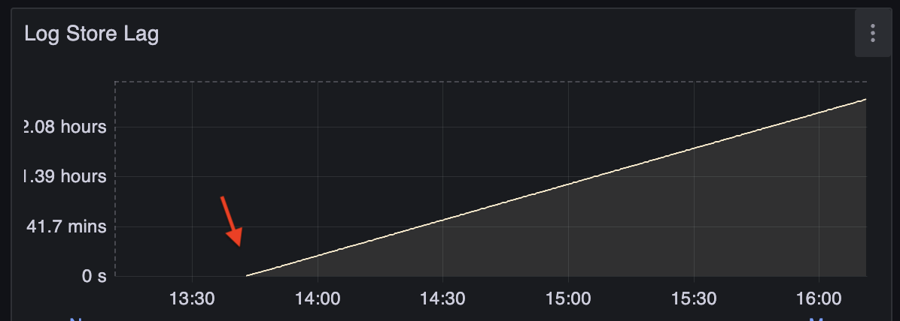

Generally, the performance of streaming jobs can be significantly affected by the sources and sinks.

- **Sources**: If the upstream system is failed or under heavy load, the source may not be able to provide data promptly, causing zero or slow data ingestion and high end-to-end latency.
- **Sinks**: If the downstream system is failed or under heavy load, RisingWave may not be able to write data to the sink promptly, causing high backpressure and increasing latency.

This guide aims to help you identify the problems caused by sources and sinks. To troubleshoot these issues, usually you need to check the upstream or downstream systems and fix the root causes.

## Symptoms

A source problem can be identified by checking the **Source Throughput** panel in the **Grafana dashboard (dev)** > **Streaming** section. If the ingestion rate is zero or significantly lower than expected, the source may be the bottleneck.

A sink problem is usually more serious because it back-pressures the entire streaming job, causing high barrier latency. To mitigate this issue, RisingWave introduced **sink decoupling** (i.e. buffering) before writing to the sink since v1.10. However, if the sink is still under heavy load, the buffer may be full, causing the entire streaming job to be blocked.

To identify a sink problem, navigate to the **Log Store Lag** panel in the **Grafana dashboard (dev)** > **Sink Metrics** section. This panel shows how much data is waiting to be written out. If the lag is increasing, the sink may be the bottleneck.

:::info

We are rolling out sink decoupling to all sinks now. Track the latest progress [here](https://github.com/risingwavelabs/risingwave/issues/17095).

:::

## Diagnosis

It's usually helpful to check the logs of both RisingWave and the source/sink systems, especially when source/sink fails instead of being slow.

Source and sink connectors are running in RisingWave Compute Nodes, and sometimes require validation in Meta node. Please search for "`risingwave_connector_node`" in the RisingWave logs to find related information.

The root causes of source and sink problems are various. You may need to check their documents or logs to address the root causes.

Here are some common issues:

- Source or sink system is down, overloaded or misconfigured, causing RisingWave to fail to connect to it.
- Poor network between RisingWave and the source/sink systems. Please make sure they are deployed in the same data center or region.
- Long running transactions in the upstream databases, preventing our CDC source from reading new changes. PostgresQL's vacuum may also cause this problem.
- Rate limit of downstream system causing frequent write failures.
- Lock contention or deadlock in the downstream database, causing long lock-wait time.