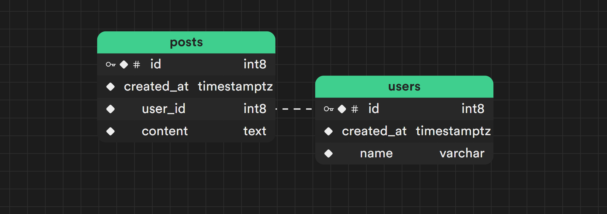
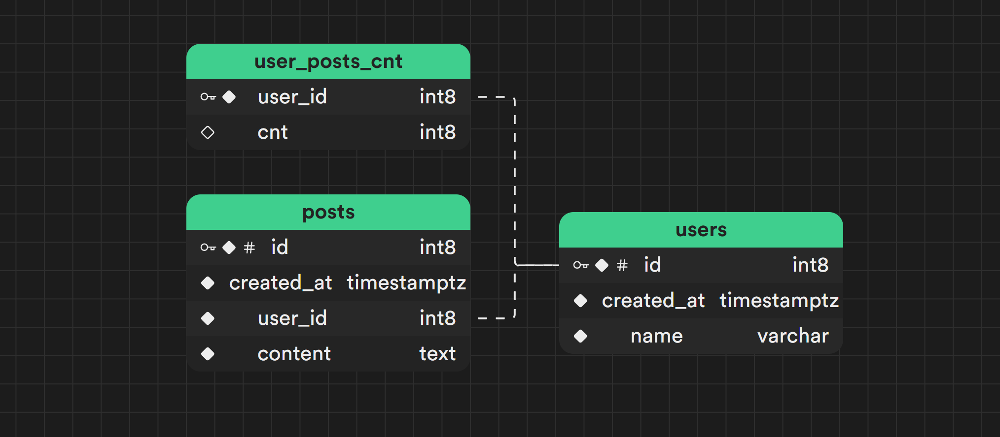

<head>
  <link rel="canonical" href="https://docs.risingwave.com/docs/current/supabase-integration/" />
</head>

Supabase is an open-source Firebase alternative. It uses PostgreSQL as the underlying storage system, and therefore can be integrated with RisingWave seamlessly.

You can ingest data from Supabase into RisingWave, and sink data from RisingWave to Supabase.

We have an [end-to-end demo](https://www.risingwave.com/blog/unleash-the-true-power-of-supabase-realtime-with-risingwave/) to showcase how Supabase users can seamlessly integrate RisingWave to enhance the product with stream processing capabilities.

This guide provides a simplified integration between RisingWave and Supabase, focusing on a social media monitoring scenario.

Throughout this guide, we will cover the following tasks:

- Ingesting user information and post data from Supabase into RisingWave.
- Calculating real-time results for recent posts, such as the number of posts sent by users.
- Sinking the real-time results from RisingWave back to Supabase.

## Prerequisites

- Install and connect to RisingWave. For details, see [Get started](get-started.md).
- Create a new Supabase project. See [Supabase docs](https://supabase.com/docs/guides/getting-started) for details.

## Create Supabase tables and enable table replication

First, let's create two tables in Supabase. The `users` table stores user information, and the `posts` table stores posts sent by users.



Make sure the data replication of these two tables are enabled. To learn about data replication for Supabase tables, see [Replication](https://supabase.com/docs/guides/database/replication).


## Ingest data into RisingWave

Then, we can use the [PostgreSQL CDC connector](/guides/ingest-from-postgres-cdc.md) to replicate data from Supabase to RisingWave.

To ingest data into RisingWave in real time, you need to create two tables with connector settings in RisingWave:

```sql title="First table"
CREATE TABLE users (
  id int8,
  created_at TIMESTAMPTZ,
  name string,
  PRIMARY KEY(id)
)
WITH (
  connector='postgres-cdc',
  hostname = 'db.xxxxxx.supabase.co',
  port = '5432',
  username = 'postgres',
  password = 'xxxxxx',
  database.name = 'postgres',
  schema.name = 'public',
  table.name = 'users',
  publication.name = 'rw_publication' -- Database Replications name in Supabase
);
```

```sql title="Second table"
CREATE TABLE posts (
  id int8,
  created_at TIMESTAMPTZ,
  user_id int8,
  content string,
  PRIMARY KEY(id)
)
WITH (
  ...... -- same as above
);
```

## Calculate real-time results

With data ingested into RisingWave, real-time data calculations can now be performed using materialized views. Materialized views in RisingWave enable incremental computations, ensuring that the latest results are obtained whenever the materialized view is queried.

### Get the most recent posts

The following SQL statement creates a materialized view in RisingWave to get the most recent 100 posts.

```sql
CREATE MATERIALIZED VIEW recent_posts AS (
  SELECT name, content, posts.created_at as created_at FROM posts
  JOIN users ON posts.user_id = users.id
  ORDER BY posts.created_at DESC LIMIT 100
);
```

### Get trending hashtags in real time

The following SQL statement creates a materialized view in RisingWave to get the daily trending hashtags.

```sql
CREATE MATERIALIZED VIEW hot_hashtags AS WITH tags AS (
  SELECT
    regexp_matches(content, '#\w+', 'g') AS hashtag,
    created_at
  FROM posts
)
SELECT
  hashtag,
  COUNT(*) AS hashtag_occurrences,
  window_start
FROM
  TUMBLE(tags, created_at, INTERVAL '1 day')
GROUP BY
  hashtag,
  window_start;
```

### Get the number of posts sent by users

The following SQL statement creates a materialized view in RisingWave to get the number of posts sent by users.

```sql
CREATE MATERIALIZED VIEW user_posts_cnt AS (
  SELECT
    users.id AS user_id,
    COUNT(posts.id) AS cnt
  FROM posts JOIN users ON users.id = posts.user_id
  GROUP BY users.id
);
```

## Sink real-time results to Supabase

While RisingWave can directly serve real-time results, you may prefer to process these results in Supabase for further analysis.

You can use the [JDBC connector](/guides/sink-to-postgres.md) to sink data from RisingWave to Supabase.

Let's sink the real-time result of the number of posts sent by users to Supabase.

Before we create the sink in RisingWave, we need to create the destination table `user_posts_cnt` in Supabase. The schema looks like this:



After the table is created, we can now run the following statement in RisingWave to sink the result to the Supabase table we just created.

```sql
CREATE SINK supabase_user_posts_cnt
FROM user_posts_cnt WITH (
  connector='jdbc',
  jdbc.url='jdbc:postgresql://db.xxxxxx.supabase.co:5432/postgres?user=postgres&password=xxxxxx',
  table.name = 'user_posts_cnt',
  type = 'upsert',
  primary_key= 'user_id'
)
```

Once the sink is successfully created, you should be able to see the results in Supabase. Try adding new rows to the `users` and `posts` table, and you will see the results in `user_posts_cnt` are updated in real time.
